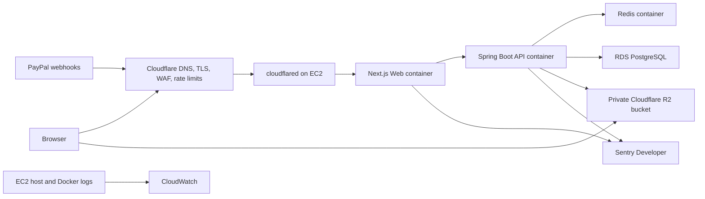

# EC2 And RDS Deployment Architecture

## Purpose

This document defines the selected cost-conscious staging and production
deployment architecture for the first public Time Archive release. It is a
design baseline, not evidence that any AWS, Cloudflare, Sentry, PayPal, or
GitHub deployment resource has been created.

The selected production baseline is:

- One ARM64 EC2 `t4g.medium` application host.
- One RDS PostgreSQL `db.t4g.small` Single-AZ database.
- Redis as a container on EC2.
- Cloudflare R2 for media storage.
- Cloudflare Tunnel for application ingress.
- SSM Parameter Store for runtime configuration and secrets.
- CloudWatch for logs, host metrics, health alarms, and deployment events.
- Sentry Developer for application error grouping after SDK integration.
- GitHub Actions OIDC, ECR, and SSM Run Command for deployment.

## Architecture Status

| Decision | Status | Notes |
| --- | --- | --- |
| Production compute | Selected | One `t4g.medium` EC2 host, subject to ARM64 image verification and load testing. |
| Production database | Selected | RDS PostgreSQL `db.t4g.small`, Single-AZ, encrypted gp3. |
| Redis | Selected | EC2 container for sessions and rate-limit counters. |
| Media storage | Selected | Dedicated private production R2 bucket. |
| Ingress | Selected | Cloudflare Tunnel; no direct public application ports. |
| Secrets | Selected | SSM Parameter Store with `SecureString` for sensitive values. |
| Logs and metrics | Selected | CloudWatch with 14-day application log retention. |
| Error tracking | Selected | Sentry Developer, pending SDK implementation. |
| Payment | Selected | PayPal, pending provider design and implementation. |
| Infrastructure as code | Selected | AWS CloudFormation for the initial AWS resource baseline. |
| Resource provisioning | Not started | Requires a separate approved infrastructure implementation plan. |

## Runtime Topology



Browser-to-R2 traffic is limited to short-lived presigned upload, preview, and
playback URLs. Application traffic enters through Cloudflare Tunnel and the Web
container. PostgreSQL, Redis, API, and Web ports are not publicly published.

## Environment Isolation

Time Archive uses three environment classes:

| Environment | Lifecycle | Data Policy |
| --- | --- | --- |
| Local | Developer controlled | Disposable local PostgreSQL and MinIO or local-only R2 resources. |
| Staging | Started for release and integration windows | Synthetic accounts, PayPal Sandbox, isolated RDS, R2, SSM, and Cloudflare hostname. |
| Production | Continuously running | Real users, real payments, immutable ownership records, production-only resources. |

Staging and production must never share:

- RDS instances or snapshots restored with production user data.
- R2 buckets, access keys, or object prefixes.
- SSM parameter paths or IAM deployment roles.
- Cloudflare Tunnel credentials.
- PayPal applications, webhook IDs, or credentials.
- Sentry environments or release labels.

To control cost, staging may be stopped or removed outside validation windows.
It must remain reproducible through CloudFormation and deployment automation.
Production data must never be copied into staging without an approved and
verified anonymization process.

## AWS Resource Baseline

### Production EC2

Initial specification:

- Instance type: `t4g.medium`, 2 vCPU, 4 GiB memory.
- Architecture: ARM64.
- Operating system: Amazon Linux 2023 ARM64.
- Root/application volume: encrypted gp3, initially 30 to 50 GiB.
- Access: AWS Systems Manager Session Manager; inbound SSH is disabled.
- Instance profile: least-privilege access to ECR, environment-specific SSM
  paths, CloudWatch, and the required KMS decrypt operation.
- Public ingress: none. `cloudflared` creates the outbound tunnel.

The host runs:

- `time-archive-web`
- `time-archive-api`
- `redis`
- `cloudflared`
- CloudWatch Agent on the host

The host does not run PostgreSQL or MinIO. Docker images are pulled from ECR;
production builds never run on the EC2 host.

Initial memory budgets are operational targets, not yet verified limits:

| Component | Initial Budget |
| --- | ---: |
| API container, including JVM native memory | 1.25 GiB |
| Web container | 512 MiB |
| Redis container | 384 MiB |
| cloudflared | 128 MiB |
| Host, Docker, CloudWatch Agent, and safety margin | Remaining memory |

The API JVM should start with a bounded heap, initially `-Xms256m -Xmx768m`,
and be tuned from CloudWatch memory and GC observations. Media scanning with a
resident ClamAV signature database is not included in this budget. Before
ClamAV is enabled, measure it on ARM64 and either move scanning to an on-demand
worker or upgrade the application host to `t4g.large`.

Every selected container image must be built or verified for `linux/arm64`.
The deployment must fail before production if any required image only supports
x86-64.

### Production RDS

Initial specification:

- Engine: the PostgreSQL major version validated by CI and supported by RDS.
- Instance: `db.t4g.small`.
- Availability: Single-AZ for the cost-conscious MVP.
- Storage: encrypted gp3, initially 20 GiB, with a reviewed maximum autoscaling
  threshold.
- Network: private DB subnet group across at least two Availability Zones.
- Public access: disabled.
- Security group: PostgreSQL port accepted only from the application EC2
  security group.
- Connection encryption: required in the JDBC connection configuration.
- Deletion protection: enabled for production.
- Final snapshot: required for intentional deletion.

Single-AZ is an explicit MVP availability tradeoff. It is not suitable for a
strict uptime commitment. Upgrade to Multi-AZ when revenue, recovery objectives,
or observed outage cost justifies the additional expense.

Application and migration identities should be separated:

- Application role: data read/write privileges required by the runtime, no
  schema ownership or unrestricted DDL.
- Migration role: schema migration privileges, available only to the controlled
  deployment migration step.
- Administrative role: break-glass operations only, not injected into the API
  container.

The current application runs Flyway through the primary datasource. Separating
the runtime and migration roles is a known implementation gap and must be
resolved before production deployment.

### Redis On EC2

Redis stores both Spring sessions and distributed rate-limit counters. Initial
production rules:

- Bind only to the private Docker network.
- Publish no host port.
- Use an encrypted EBS-backed Docker volume for append-only persistence.
- Start with a 256 MiB Redis memory ceiling and a larger container ceiling.
- Prefer `noeviction`; memory exhaustion must be visible as an alert rather
  than silently evicting sessions or security counters.
- Configure an explicit restart policy and health check.
- Treat Redis restart or loss as an availability event: sessions can be
  invalidated and protected rate-limited APIs can fail closed.

Moving Redis to ElastiCache is deferred. Triggers include multiple API hosts,
session availability requirements, memory pressure, or Redis becoming a common
deployment failure source.

### Cloudflare R2

Use separate staging and production buckets and separate least-privilege access
keys. The production bucket containing original uploads remains private.

The current application stores URLs under
`TIME_ARCHIVE_STORAGE_S3_PUBLIC_BASE_URL` as managed object references. Despite
the property name, the production value must not make original objects publicly
readable. Use a private canonical R2 S3-compatible base that the storage adapter
can map back to object keys.

Do not attach a publicly readable custom domain to the original-upload bucket.
A public custom domain would bypass moderation and presigned playback policy.
If CDN-served derived media is introduced later, use a separate derived-media
bucket or prefix with an explicit publication policy.

R2 CORS must allow only the exact staging or production Web origins and the
required presigned `PUT`, `GET`, and `HEAD` operations. Wildcard origins are not
accepted for authenticated upload workflows.

## Network And Ingress

### Cloudflare Tunnel

`cloudflared` is the only application ingress path:

```text
Cloudflare hostname -> Cloudflare Tunnel -> time-archive-web:3000
time-archive-web -> time-archive-api:8080
```

Security group rules do not expose ports `3000`, `8080`, `5432`, or `6379` to
the internet. EC2 administration uses SSM Session Manager instead of SSH.

The Tunnel design allows the API to trust a Cloudflare-provided client address
only after the Web proxy forwards it safely. The current Next.js proxy does not
forward `CF-Connecting-IP`. Therefore:

- Keep `TIME_ARCHIVE_RATE_LIMIT_CLIENT_IP_HEADER` empty in the first staging
  deployment.
- Add and test trusted client-address propagation as an operational security
  task.
- Set `TIME_ARCHIVE_RATE_LIMIT_CLIENT_IP_HEADER=CF-Connecting-IP` only after
  direct origin access is impossible and the Web proxy overwrites, rather than
  appends, the forwarded value.

### TLS And Cookies

Cloudflare terminates public TLS and the Tunnel protects origin transport.
Before staging approval, verify:

- Session cookies are `Secure`, `HttpOnly`, and use the intended `SameSite`
  policy.
- CSRF cookies remain readable only where required by the Web client.
- HSTS, frame protection, content type sniffing protection, and referrer policy
  are present.
- Forwarded protocol handling does not cause insecure redirects or cookies.

These controls are not fully configured or verified in the current application
and remain part of the operational security phase.

## SSM Parameter Store

Use environment-scoped paths:

```text
/time-archive/staging/...
/time-archive/production/...
```

Suggested sensitive parameters:

```text
/time-archive/{environment}/database/username
/time-archive/{environment}/database/password
/time-archive/{environment}/r2/access-key
/time-archive/{environment}/r2/secret-key
/time-archive/{environment}/rate-limit/key-salt
/time-archive/{environment}/cloudflare/tunnel-token
/time-archive/{environment}/paypal/client-secret
/time-archive/{environment}/paypal/webhook-id
```

Non-sensitive configuration such as endpoints, bucket names, limits, and log
levels may use `String`. Credentials and cryptographic material use
`SecureString` with the approved KMS key.

The EC2 instance role can read only its environment path. The GitHub deployment
role can request deployment through SSM but does not read application secrets.
Staging and production roles cannot read each other's parameters.

At deployment time, a root-owned host script:

1. Reads the allowed SSM path with decryption.
2. Maps parameters to the exact application environment variable names.
3. Writes `/run/time-archive/runtime.env` with mode `0600`.
4. Runs Docker Compose with that file.
5. Never prints values, generated env content, or `docker inspect` output in CI.

`/run` is outside the repository and is cleared on reboot. Docker environment
variables remain visible to root-equivalent Docker administrators, so EC2 and
SSM administrative access must remain tightly controlled.

## Production Container Model

The future production Compose configuration is separate from local Compose.
It must:

- Reference ECR images by immutable Git SHA.
- Omit `build:` and `latest` tags.
- Omit PostgreSQL, MinIO, and `minio-init` services.
- Keep fake payment disabled and omit the fake webhook route from production
  behavior.
- Publish no API, Web, or Redis host ports.
- Add restart policies, health checks, bounded resources, and CloudWatch log
  delivery.
- Use a project name that identifies the environment.
- Use a persistent Redis volume and no source-code bind mounts.

Do not reuse `.env.local` or `.env.r2.local` on EC2. Do not commit an
`.env.production` file.

## Image And Deployment Flow

```mermaid
flowchart LR
    Merge["Merge to main"] --> CI["CI and security gates"]
    CI --> Build["Build linux/arm64 API and Web images"]
    Build --> ECR["Push ECR images tagged with Git SHA"]
    ECR --> Stage["Deploy on-demand staging through SSM Run Command"]
    Stage --> Smoke["Migration and staging smoke checks"]
    Smoke --> Approval["GitHub production environment approval"]
    Approval --> Prod["Deploy same image SHAs to production"]
    Prod --> Verify["Production health and smoke checks"]
```



GitHub Actions uses OIDC to assume short-lived AWS roles. No long-lived AWS
access key is stored in GitHub. Deployment commands use SSM Run Command, not
SSH.

The deployment artifact records:

- API image repository and SHA tag.
- Web image repository and SHA tag.
- Git commit SHA.
- migration version before and after deployment.
- actor, environment, start time, completion time, and result.

Production deploys the exact image digests verified in staging. It does not
rebuild images after approval.

## Database Migration Flow

Production migrations are a controlled step before application replacement:

1. Confirm RDS automated backup and latest recovery point.
2. Run Flyway from the immutable API image with migration credentials.
3. Stop if migration fails; do not replace the running application.
4. Deploy API and Web images only after migration succeeds.
5. Run health and compatibility smoke checks.

Prefer expand-and-contract migrations:

- Add compatible schema first.
- Deploy code that supports old and new data where necessary.
- Backfill separately.
- Remove old columns or constraints only in a later approved release.

Application rollback uses the previous image SHA. Database rollback normally
uses a forward-fix migration. Point-in-time restore is reserved for severe data
corruption because it can discard legitimate writes after the recovery point.

## Health Checks And Rollback

Deployment health gates:

- API container health: `/actuator/health` from the private Docker network.
- Web container health: root page and timeline proxy response.
- Redis health: authenticated `PING` if authentication is introduced.
- RDS health: application health and a migration connectivity check.
- Cloudflare health: public staging or production hostname.

Rollback procedure:

1. Keep the previous API and Web image SHAs in the deployment record.
2. If post-deploy checks fail, restore the previous Compose image references.
3. Run `docker compose up -d` through SSM Run Command.
4. Verify private and public health checks.
5. Record the rollback event and preserve failed-container logs.

A failed EC2 host is replaced from CloudFormation and bootstrap automation.
Application state must remain in RDS, R2, SSM, and the Redis volume. Session
loss is acceptable during a full host replacement for the initial MVP; payment
and ownership records are not.

## Backups And Data Operations

Before a paid launch:

- Enable RDS automated backups and point-in-time recovery.
- Select and document production backup retention.
- Enable deletion protection and final snapshots.
- Perform one restore drill into an isolated database.
- Verify Flyway against the restored database.
- Document RTO and RPO measured by the drill.
- Define retention for sessions, upload requests, rejected media, and audit
  logs.

R2 object backup and retention policy is separate from RDS backup. Database
rows and R2 objects form one consistency boundary; restoring only one side can
produce broken references.

## Observability Baseline

CloudWatch baseline:

- Application log groups with 14-day retention.
- EC2 CPU, memory, disk, and status checks.
- Docker restart and unhealthy-container events.
- API 5xx rate and latency when application metrics are implemented.
- RDS CPU, storage, connections, and freeable memory.
- deployment and migration success or failure events.

Initial alarms:

- EC2 instance or system status check failure.
- disk or memory pressure.
- API or Web health check failure.
- RDS storage, connection, or CPU pressure.
- repeated container restart.
- deployment or migration failure.

Sentry Developer is selected but not yet implemented. When added, use separate
staging and production environments, immutable release SHAs, source-map upload
for Web, server exception capture for API, and strict filtering of credentials,
cookies, CSRF tokens, payment payloads, and presigned URLs.

## Cost Baseline

The expected initial production infrastructure is approximately USD 94 to 100
per month before tax and variable traffic charges:

- EC2 `t4g.medium` and gp3 host volume.
- one public IPv4 address required for general outbound internet access in the
  initial public-subnet design, even though ingress uses Cloudflare Tunnel.
- RDS `db.t4g.small` Single-AZ and 20 GiB gp3.
- a small CloudWatch log, metric, and alarm budget.
- R2 and Sentry within their initial free tiers.
- SSM Parameter Store standard parameters.

Staging costs are additional while staging resources are running. The staging
environment should be started for release windows and stopped or removed when
not needed. Data transfer, log volume, R2 growth, snapshots, PayPal fees, and
future malware scanning can increase the total.

## Known Implementation Gaps

The following work must be completed before the first staging deployment:

- Add production-specific Compose and host bootstrap files.
- Add ECR ARM64 image build and push workflow.
- Add GitHub OIDC deployment roles and SSM Run Command workflow.
- Add CloudFormation templates for network, EC2, RDS, IAM, ECR, SSM access,
  CloudWatch, and staging lifecycle.
- Separate Flyway migration credentials from runtime database credentials.
- Configure production session cookies and security headers.
- Add trusted Cloudflare client-address propagation through the Web proxy.
- Configure production Redis persistence, memory policy, and health checks.
- Add structured logs, correlation IDs, and CloudWatch alarms.
- Integrate Sentry without sensitive data collection.
- Replace environment-based initial admin bootstrap with operator-controlled
  provisioning.
- Implement PayPal before enabling real payments.
- Implement media signature validation and the approved malware-scanning path
  before public media publication.

## Provisioning Approval Boundary

Creating CloudFormation stacks, EC2, RDS, ECR, IAM roles, CloudWatch alarms,
SSM parameters, Cloudflare Tunnels, DNS records, or R2 production resources
changes external state and can incur cost. A separate implementation plan must
list exact resources, IAM permissions, estimated cost, rollback, and required
owner inputs before any provisioning command runs.

## Official References

- [AWS Systems Manager Parameter Store](https://docs.aws.amazon.com/systems-manager/latest/userguide/systems-manager-parameter-store.html)
- [AWS Systems Manager Run Command](https://docs.aws.amazon.com/systems-manager/latest/userguide/run-command.html)
- [Amazon RDS backups](https://docs.aws.amazon.com/AmazonRDS/latest/UserGuide/USER_Backup.html)
- [Amazon RDS SSL/TLS](https://docs.aws.amazon.com/AmazonRDS/latest/UserGuide/UsingWithRDS.SSL.html)
- [GitHub Actions OIDC with AWS](https://docs.github.com/en/actions/how-tos/security-for-github-actions/security-hardening-your-deployments/configuring-openid-connect-in-amazon-web-services)
- [Cloudflare Tunnel](https://developers.cloudflare.com/cloudflare-one/networks/connectors/cloudflare-tunnel/)
- [Cloudflare R2 pricing](https://developers.cloudflare.com/r2/pricing/)
- [Sentry pricing](https://sentry.io/pricing/)
